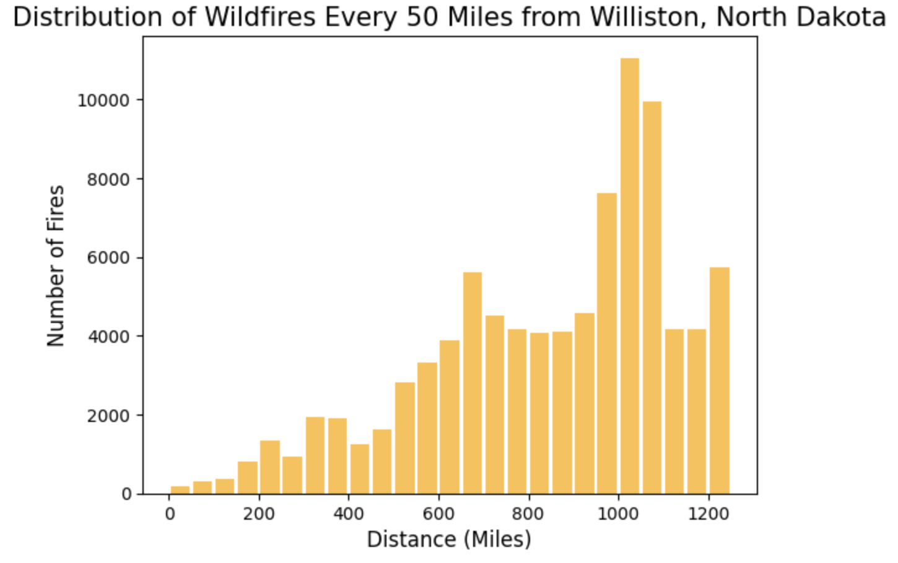
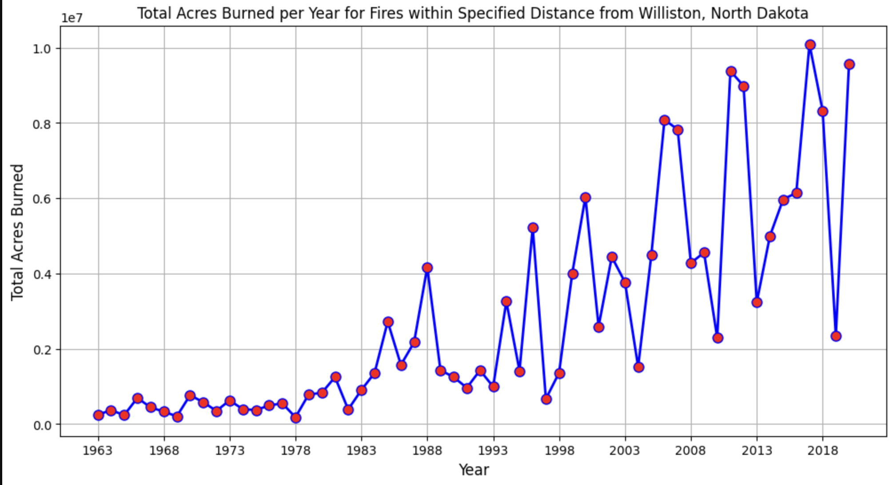
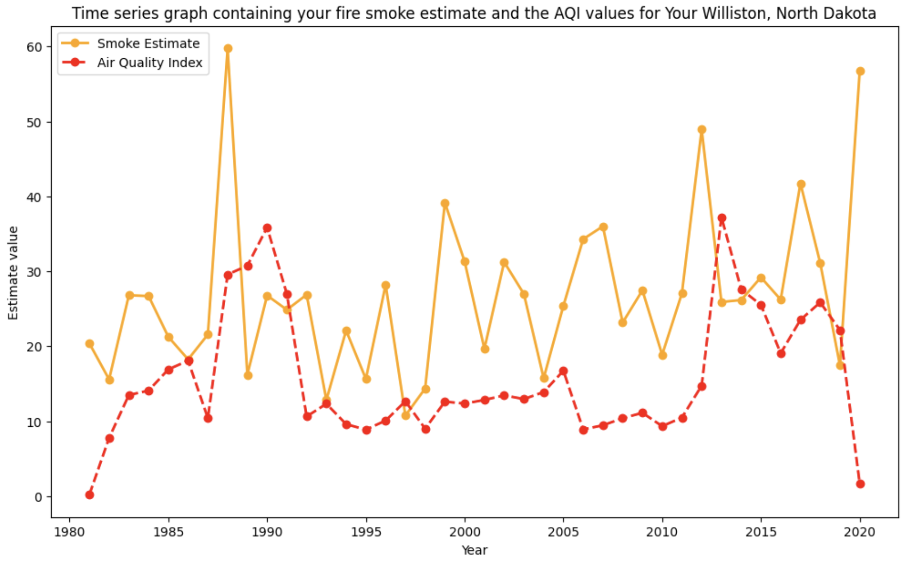
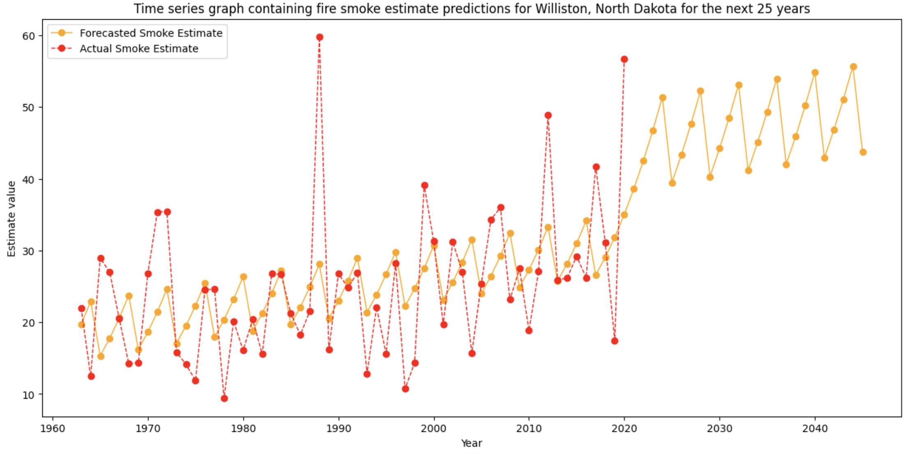

# DATA 512 PROJECT

## PART 1: COMMON ANALYSIS

# Wildfire Smoke Impact Analysis

## Introduction

This project aims to analyze the estimated smoke impacts of wildfires on a specific city in the US over the last 60 years. The analysis focuses on the period from 1963 to 2023 and considers fires that occurred within 1250 miles of the assigned city. The primary goal is to create a predictive model for the next 25 years (2024-2049), offering insights into the potential future impacts of wildfires.

## Data Acquisition

The project utilizes the "Combined wildland fire datasets for the United States and certain territories, 1800s-Present" dataset collected and aggregated by the US Geological Survey. The dataset provides fire polygons in ArcGIS and GeoJSON formats.

## Data Analysis

### 1. Smoke Estimate

To estimate wildfire smoke impact, the following conditions are considered:
- Analysis period: 1963-2023
- Fires within 1250 miles of the assigned city
- Annual fire season: May 1st to October 31st

The process involves:
1. Retrieving and processing wildfire data within the specified distance from the assigned city.
2. Defining a smoke estimate, considering factors such as fire size and proximity.
3. Applying the smoke estimate to each fire within the analysis period.

### 2. Comparing with AQI

The estimated smoke impact is compared to the Air Quality Index (AQI) data obtained from the US EPA. Challenges include the limited availability of AQI data before the early 1980s and the sparse coverage of monitoring stations. The comparison helps assess the validity of the smoke estimate.

### 3. Predictive Model

A predictive model is developed to estimate smoke impacts for the next 25 years (2024-2049). The model incorporates the historical fire and smoke data to make informed predictions while considering uncertainties.

## PART 2: EXTENSION 

This extension plan seeks to delve deeper into the analysis of wildfire impact on economic factors. The primary focus involves a comprehensive investigation using diverse datasets to explore the correlation between wildfires, air quality, and various economic indicators - unemployment rate and median household income in Williston, North Dakota. Leveraging advanced statistical methods and visualization techniques, the plan aims to provide more nuanced insights into the relationship between these variables. It includes the development of forecasting models to predict future trends in economic indicators affected by wildfire occurrences. The extension plan further entails creating informative visualizations, including correlation matrices and trend forecasts, to communicate these complex relationships effectively. 

### Data Sources

#### Wildland Fire Datasets for the United States and Territories
- **Source:** US Geological Survey
- **Format:** ArcGIS and GeoJSON

#### Annual Unemployment Rate (all ages) - North Dakota Dataset
- **Source:** Local/National Statistical Agencies
- **Timeframe:** 2000 to 2022
- **Type:** Numerical (Unemployment Rate)
- **Format:** Tabular (CSV/Excel)

#### Median Household Income - North Dakota Dataset
- **Source:** Local/National Statistical Agencies
- **Timeframe:** Varied years across locations in North Dakota
- **Type:** Numerical (Income)
- **Format:** Tabular (CSV/Excel)

### Data Types of Columns

#### Annual Unemployment Rate (all ages) - North Dakota Dataset

| Column Name | Description                | Data Type |
|-------------|----------------------------|-----------|
| LocationType| Type of geographical location (e.g., State, County) | Text/String |
| Location    | Specific location within North Dakota (e.g., State, County names) | Text/String |
| TimeFrame   | Year or time frame covered in the dataset | Date/Year |
| DataFormat  | Format of the data (e.g., Currency) | Text/String |
| Data        | Numerical data representing the unemployment rate | Numeric (Float/Decimal) |

#### Median Household Income - North Dakota Dataset

| Column Name | Description                | Data Type |
|-------------|----------------------------|-----------|
| LocationType| Type of geographical location (e.g., State, County) | Text/String |
| Location    | Specific location within North Dakota (e.g., State, County names) | Text/String |
| TimeFrame   | Year or time frame covered in the dataset | Date/Year |
| DataFormat  | Format of the data (e.g., Percentage) | Text/String |
| Data        | Numerical data representing the income | Numeric (Integer/Float/Decimal) |

## Code Snippets and Attribution

This project encourages collaboration and sharing of code snippets, statistical approaches, and visualization techniques. When borrowing or reusing code, it's important to provide attribution to the original contributor. The mantra for sharing is "I can help you understand this, but I won't do this for you."

## Visualization

The analysis is illustrated through time series graphs, including:
- A histogram showing the number of fires occurring at various distances from the assigned city.

- A time series graph of total acres burned per year for fires within the specified distance.
- 
- A time series graph displaying the fire smoke estimate for the assigned city alongside the AQI estimate.
- 
- 

## Directories

### `images`

- Directory for storing images related to the project.

### `intermediate data files`

- Directory for storing intermediate data files generated during the analysis.

## Files

### `AQI_Williston.ipynb`

- Jupyter Notebook containing code for scraping Air Quality Index (AQI) data.

### `LICENSE.md`

- Markdown file containing the project's license information.

### `README.md`

- Markdown file providing an overview and details of the project.

### `Visualizations.ipynb`

- Jupyter Notebook containing code for creating data visualizations.

### `Wildfire_Williston.ipynb`

- Main Jupyter Notebook for the project, including wildfire data analysis and smoke impact estimation.

## Conclusion

This project aims to provide valuable insights into the estimated smoke impacts of wildfires on the assigned city and create a predictive model for future scenarios. The results may inform policy decisions and preparedness for wildfire events in the region.

For more details and code examples, please refer to the project files.
